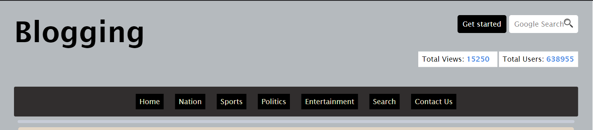
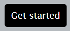
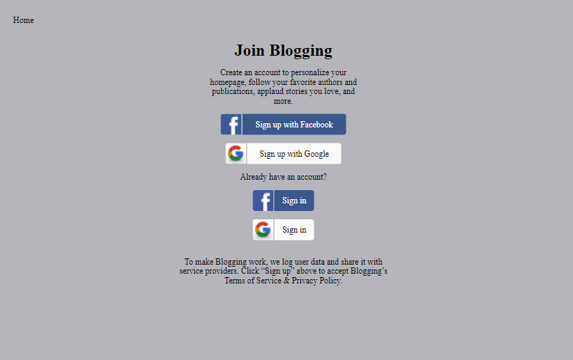
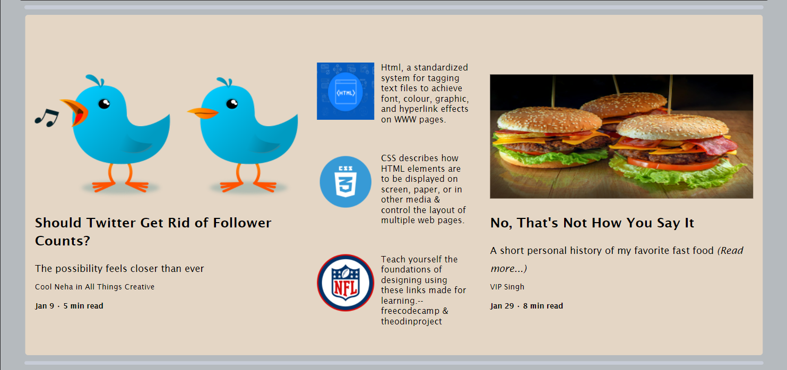
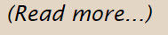
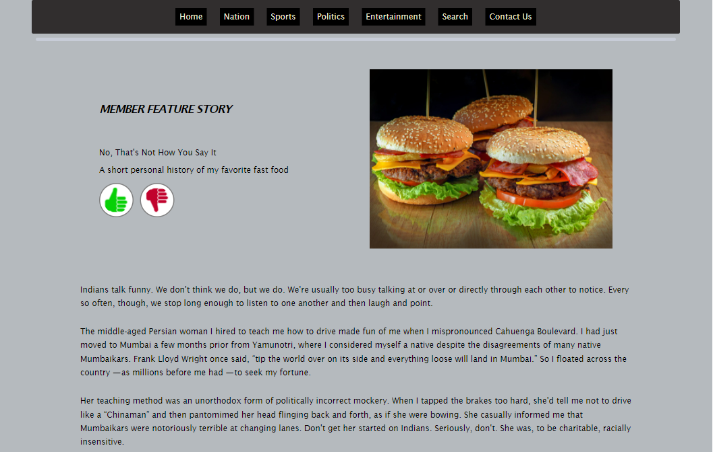
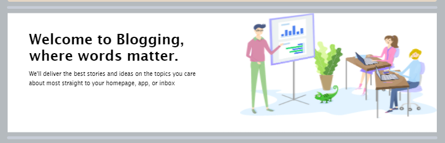
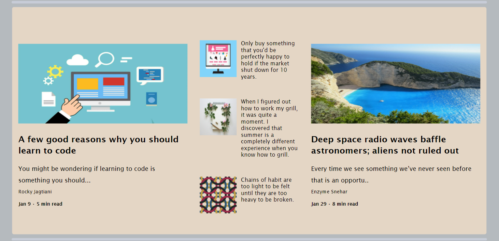

# Blogging

## Overview
#### The website is fully-responsive on different devices!

### Nav-bar

#### There's a navbar with different clickable links 

#### Click here to sign-up/ sign-in 

#### This will direct you to sign-up page

### Content of the blog - Part-1

#### Click here to read more about the content!

### This will redirect you to the full-content of the blog!

### Content of the blog!- Part-2

### Content of the blog - Part-3

### There's a footer below with links of various social-sites

### Links

- Solution URL: (https://github.com/Sonu-Dutta/Travel-website)
- Live Site URL: (https://travel-website-sonu-dutta.vercel.app/)

## My process

### Built with

- Visual Studio Code
- Semantic HTML5 markup
- CSS custom properties
- Flexbox
- CSS Grid
- Bootstrap
- Mobile-first workflow
- [React](https://reactjs.org/) - JS library
- [Next.js](https://nextjs.org/) - React framework

## Author

- Linkedin - [Sonu-Dutta](https://www.linkedin.com/in/sonu-dutta-6900b3218)
- Twitter - [@sonudutta9999](https://mobile.twitter.com/sonudutta9999)

